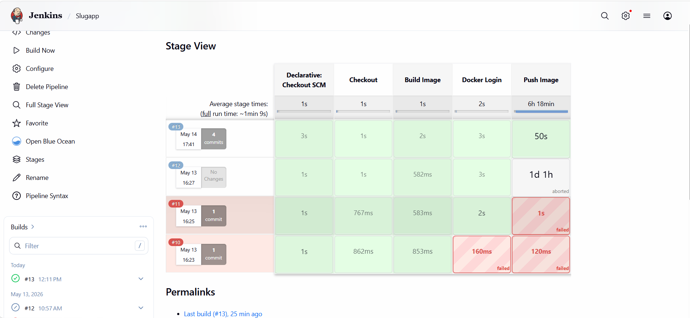
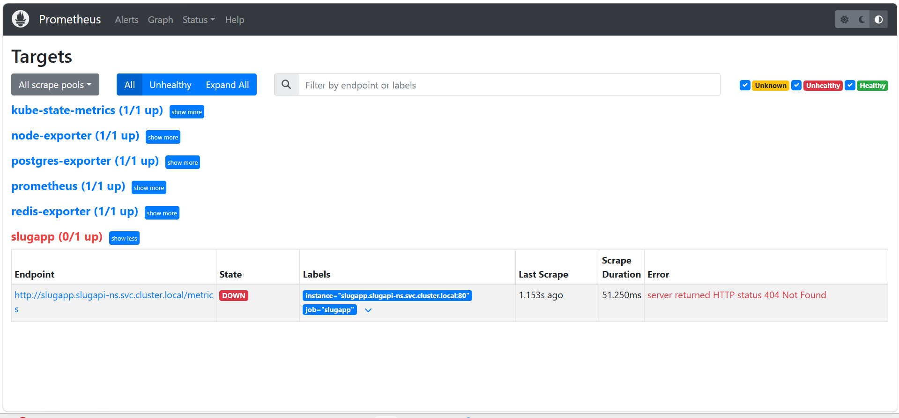
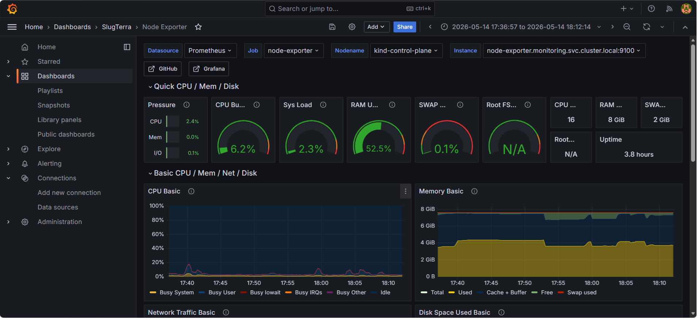
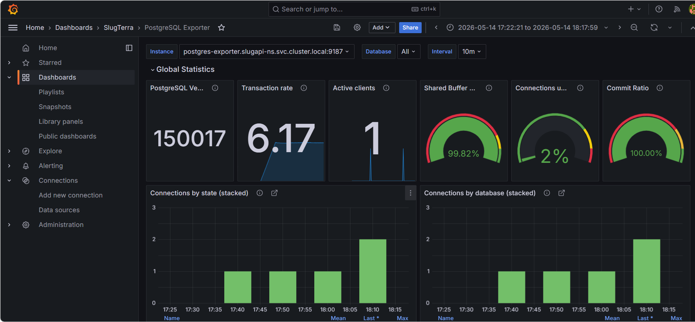
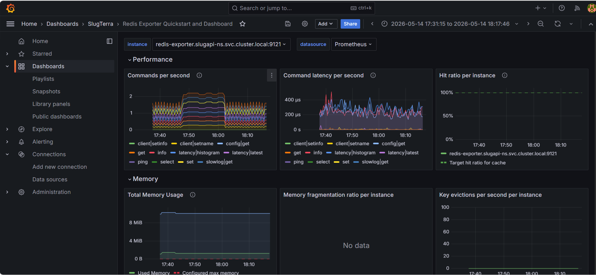

# SlugTerraAPI

A Django REST API for browsing SlugTerra slug data, running slug duel simulations, and viewing summary statistics.

This project serves slug information from a JSON dataset and exposes it through clean HTTP endpoints with filtering, pagination, and interactive API docs.

## Contents

1. Project Overview
2. Features
3. Tech Stack
4. Repository Structure
5. Prerequisites
6. Quick Start (Local)
7. Running with Docker
8. Running on Kubernetes
9. CI/CD Pipeline (Jenkins)
10. Monitoring and Alerting
11. API Documentation UI
12. API Endpoints
13. Load Testing with Locust
14. Data Source and Image Assets
15. Troubleshooting
16. Notes for Production
17. AWS Deployment

## Project Overview

SlugTerraAPI is built with Django + Django REST Framework and currently reads data from:

- `config/slugs_data.json`

It does not use database models for slug records at runtime. The API includes:

- A paginated slug list endpoint with filters
- A slug detail endpoint (case-insensitive by name)
- A stats endpoint for element/rarity/power-type counts
- A duel simulation endpoint with deterministic results via seed
- Swagger and ReDoc interactive docs

## Features

- JSON-backed API data (no slug model required)
- Pagination with configurable page size
- Filtering by search, element, rarity, and power type
- Duel simulation with round-level score breakdown
- OpenAPI docs via drf-yasg
- Dockerfile for containerized development
- Locust load test script
- Utility script to download and normalize slug images

## Tech Stack

- Python 3.12
- Django 5.2.12
- Django REST Framework 3.17.1
- django-filter 25.2
- drf-yasg 1.21.15
- SQLite (default)
- Optional PostgreSQL dependency present in requirements
- Optional Redis/Celery dependencies present in requirements

## Repository Structure

```text
SlugTerraAPI/
  README.md
  download_slug_images.py
  config/
    manage.py
    requirements.txt
    db.sqlite3
    slugs_data.json
    locustfile.py
    Dockerfile
    config/
      settings.py
      urls.py
    slugs/
      urls.py
      views.py
      models.py
    slug_images/
      ... (slug image folders)
```

## Prerequisites

- Python 3.12+ recommended
- pip
- Git (optional)
- Docker Desktop (optional, if running containerized)
- kubectl + a Kubernetes cluster (optional, if running on Kubernetes)

## Quick Start (Local)

### 1. Create and activate a virtual environment

Windows PowerShell:

```powershell
python -m venv .venv
.\.venv\Scripts\Activate.ps1
```

macOS/Linux:

```bash
python3 -m venv .venv
source .venv/bin/activate
```

### 2. Install dependencies

```bash
pip install -r requirements.txt
```

### 3. Apply migrations

```bash
python manage.py migrate
```

### 4. Start the development server

```bash
python manage.py runserver
```

Server default:

- http://127.0.0.1:8000/

## Running with Docker

Use Docker Compose for local containerized development (includes PostgreSQL + Redis).

### 1. Build image (optional)

From the `config/` folder:

```bash
docker build -f docker/Dockerfile -t slugterra-api:dev .
```

### 2. Start with Docker Compose

From the `config/` folder:

Windows PowerShell:

```powershell
Copy-Item .env.example .env
```

macOS/Linux:

```bash
cp .env.example .env
```

Update values in `.env` if needed, especially `DJANGO_SECRET_KEY` and `POSTGRES_PASSWORD`.

Then run:

```bash
docker compose up --build
```

Run in detached mode:

```bash
docker compose up --build -d
```

Stop and remove containers:

```bash
docker compose down
```

Stop and remove containers + volumes (removes PostgreSQL data):

```bash
docker compose down -v
```

Useful commands:

```bash
docker compose ps
docker compose logs -f web
docker compose exec web python manage.py createsuperuser
```

Default exposed ports in this setup:

- API app: 8000
- PostgreSQL: 5432
- Redis: 6379

## Running on Kubernetes

Kubernetes manifests are available in `k8s/`:

- `k8s/namespace.yml`
- `k8s/postgres.yml`
- `k8s/redis.yml`
- `k8s/deployment.yml`
- `k8s/service.yml`
- `k8s/ingress.yml`
- `k8s/hpa.yml`

### 1. Apply manifests

From `config/` folder:

```bash
kubectl apply -f k8s/namespace.yml
kubectl apply -f k8s/configmap.yml
kubectl apply -f k8s/secret.yml
kubectl apply -f k8s/postgres.yml
kubectl apply -f k8s/redis.yml
kubectl apply -f k8s/deployment.yml
kubectl apply -f k8s/service.yml
kubectl apply -f k8s/ingress.yml
kubectl apply -f k8s/hpa.yml
kubectl apply -f k8s/monitoring/
```

### 2. Verify resources

```bash
kubectl apply -f https://raw.githubusercontent.com/kubernetes/ingress-nginx/main/deploy/static/provider/kind/deploy.yaml
kubectl get ns
kubectl get deploy,svc,ingress,hpa -n slugapi-ns
kubectl get pods -n slugapi-ns -w
```

### 3. Access the API locally

If you have an ingress controller installed, port-forward it to loopback:

```bash
kubectl port-forward -n ingress-nginx service/ingress-nginx-controller 80:80
```

Then open:

- http://127.0.0.1/

If you do not have ingress running, use port-forward on the `ClusterIP` service:

```bash
kubectl port-forward -n slugapi-ns service/slugapp 8000:80
```

Then open:

- http://127.0.0.1:8000/

### 4. Monitor logs

Use Loki through Grafana Explore for pod log search across the cluster. The monitoring stack ships Promtail as a DaemonSet, so all node-local container logs are collected automatically.

Port-forward Loki if you want to verify ingestion directly:

```bash
kubectl port-forward -n monitoring service/loki 3100:3100
```

Then query logs in Grafana with labels like `namespace="slugapi-ns"`.

## Unified Deploy Command (kind)

Use the deploy script for local Kubernetes deployments using kind.

From `config/` folder:

```bash
bash scripts/deploy.sh kind
```

This path creates/uses the kind cluster, builds a local app image, loads it into kind, and applies all Kubernetes manifests.

Environment variables supported by the script:

- `TARGET`: `kind` (default)
- `LOCAL_IMAGE_NAME`: image name for `kind` (default `slugterra-api:local`)
- `BUILD_LOCAL_IMAGE`: `true|false` for `kind`
- `KIND_CLUSTER_NAME`: kind cluster name (default `slugterra`)
- `SKIP_MONITORING`: `true|false`

### Clean up

```bash
kubectl delete -f k8s/hpa.yml
kubectl delete -f k8s/ingress.yml
kubectl delete -f k8s/service.yml
kubectl delete -f k8s/deployment.yml
kubectl delete -f k8s/secret.yml
kubectl delete -f k8s/configmap.yml
kubectl delete -f k8s/namespace.yml
```

### Notes

- Current deployment image in `k8s/deployment.yml` is `harshchauhan01/slug-api:latest`.
- Runtime values are now supplied through `k8s/configmap.yml` and `k8s/secret.yml`.
- Update `k8s/secret.yml` values before applying in shared environments.
- If you build your own image, push it to a registry and update the `image` field before applying.
- A local kind cluster config exists at `kind-cluster/kind-config.yml`.
- The app deployment expects the PostgreSQL service name `db` and Redis service name `redis`.
- The ingress rule does not use a host because Kubernetes ingress hosts must be DNS names, not IP addresses.
- To keep access on `127.0.0.1` only, port-forward the ingress controller to `127.0.0.1:80`.


## CI/CD Pipeline (Jenkins)

This repository provides a Jenkins Pipeline at `config/Jenkinsfile`. The current pipeline is intentionally simple and matches the repository's Docker-based delivery flow:

- Checkout the repository
- Build the Docker image from `docker/Dockerfile`
- Log in to Docker Hub with Jenkins credentials
- Push the image to Docker Hub as `harshchauhan01/slug-api:latest`



Use
```
docker rm -f jenkins

docker run -d \
  --name jenkins \
  --restart unless-stopped \
  -p 8090:8080 \
  -p 50000:50000 \
  -v jenkins_home:/var/jenkins_home \
  jenkins/jenkins:lts
```


### What Jenkins needs

- A Jenkins instance with Docker installed on the agent or controller that runs the job
- Access to the repository that contains this project
- A Jenkins credential with ID `dockerhub-credentials`
- Permission for Jenkins to run `docker build`, `docker login`, and `docker push`

### Jenkins job setup

1. Create a new Pipeline job in Jenkins.
2. Set the job to use `Pipeline script from SCM`.
3. Select `Git` as the SCM.
4. Point the repository URL to this project.
5. Set the Branch Specifier to the branch you want to build, such as `*/main`.
6. Set the Script Path to `config/Jenkinsfile`.
7. Save the job.

### Webhook trigger on push

To run Jenkins automatically after every push, configure a GitHub webhook and enable the SCM trigger in Jenkins:

1. In Jenkins, open the job configuration and enable `GitHub hook trigger for GITScm polling`.
2. In GitHub, open the repository settings and add a webhook.
3. Set the Payload URL to `http://<JENKINS_HOST>/github-webhook/`.
4. Set Content type to `application/json`.
5. Choose `Just the push event` so each push triggers a new Jenkins build.

With this setup, every push to the configured branch will notify Jenkins, Jenkins will read `config/Jenkinsfile`, and the pipeline will rebuild and push the image automatically.

### Pipeline credentials

The Jenkinsfile expects the Docker Hub credential ID to be `dockerhub-credentials`.

### Practical note

Because this pipeline only builds and pushes the image, the Kubernetes deployment step happens separately on your cluster by applying the manifests in `config/k8s`.

## Infrastructure as Code and AWS Deployment

For detailed step-by-step instructions on deploying SlugTerraAPI to AWS with the current kubeadm-on-EC2 setup, please refer to:

**[AWS Deployment Guide](docs/aws.md)**

The AWS deployment guide covers:
- AWS prerequisites and credential setup
- Terraform provisioning for the 3-node EC2 cluster in `config/terraform1`
- kubeadm bootstrap with containerd and Calico
- Deploying the Kubernetes manifests from `config/k8s`
- Pulling the application image from Docker Hub
- Ingress and storage notes for bare kubeadm clusters
- Cleanup and teardown procedures
- Troubleshooting common issues

## Monitoring and Alerting

The Django app exposes `/metrics` via `django-prometheus`.

Monitoring manifests are in `k8s/monitoring/` and include:

- Prometheus config, deployment, and service
- Postgres and Redis exporters for database/cache dashboards
- Node Exporter and kube-state-metrics for host and cluster dashboards
- Alert rules config (`prometheus-alerts-configmap.yml`)
- Grafana deployment, datasource, and dashboard provisioning

### Prometheus Dashboard



### Grafana Dashboards







Apply monitoring stack:

```bash
kubectl apply -f k8s/monitoring/namespace.yml
kubectl apply -f k8s/monitoring/
```

If you update only monitoring components later, the same command is enough because the directory includes Prometheus, Grafana, exporters, and dashboard config maps.

Access dashboards locally:

```bash
kubectl port-forward -n monitoring service/prometheus 9090:9090
kubectl port-forward -n monitoring service/grafana 3000:3000
```

Grafana default login:

- Username: admin
- Password: admin

For Dashboard Use:
- Node Exporter: Import ID (1860)
- PostgreSQL Exporter: Import ID (12485)
- Redis Exporter: Import ID (14091)

## API Documentation UI

After server startup:

- Swagger UI: http://127.0.0.1:8000/swagger/
- ReDoc: http://127.0.0.1:8000/redoc/
- Raw schema: http://127.0.0.1:8000/swagger.json

## API Endpoints

Base URL:

- http://127.0.0.1:8000

### 1) Home

- Method: GET
- Path: /
- Purpose: API welcome payload and endpoint map

Example:

```http
GET /
```

### 2) List slugs

- Method: GET
- Path: /api/slugs/
- Purpose: Paginated slug list with optional filters

Query parameters:

- page (int): page number
- page_size (int): items per page (default 24)
- search (string): partial match on slug name
- element (string): exact element match (case-insensitive)
- rarity (string): exact rarity match (case-insensitive)
- power_type (string): substring match on power type (case-insensitive)

Examples:

```http
GET /api/slugs/
GET /api/slugs/?page=2&page_size=12
GET /api/slugs/?search=beek
GET /api/slugs/?element=fire&rarity=rare
GET /api/slugs/?power_type=ghoul
```

### 3) Slug detail

- Method: GET
- Path: /api/slugs/<slug_name>/
- Purpose: Returns one slug by exact name (case-insensitive)

Examples:

```http
GET /api/slugs/Aquabeek/
GET /api/slugs/infurnus/
```

Possible errors:

- 404 with detail message when slug is not found

### 4) Slug stats

- Method: GET
- Path: /api/slugs/stats/
- Purpose: Aggregate counts for elements, rarities, and power types

Example:

```http
GET /api/slugs/stats/
```

### 5) Slug duel simulation

- Method: GET
- Path: /api/slugs/duel/
- Purpose: Simulate duel rounds between two slugs

Required query parameters:

- slug_a (string)
- slug_b (string)

Optional query parameters:

- rounds (int): clamped to range 1..9, default 3
- seed (int): default 0 (deterministic simulation when fixed)

Example:

```http
GET /api/slugs/duel/?slug_a=Aquabeek&slug_b=Infurnus&rounds=3&seed=42
```

Possible errors:

- 400 if slug_a or slug_b is missing
- 404 if either slug does not exist

## Load Testing with Locust

Load profile script:

- `config/locustfile.py`

Run Locust from inside config folder:

```bash
locust -f locustfile.py --host=http://127.0.0.1:8000
```

Open Locust UI:

- http://127.0.0.1:8089

The locust file includes traffic for:

- /
- /api/slugs/
- /api/slugs/ with filters
- /api/slugs/stats/
- /api/slugs/<name>/
- /api/slugs/duel/

## Data Source and Image Assets

Primary slug dataset:

- `config/slugs_data.json`

Image utility script:

- `download_slug_images.py`

What the image script does:

- Reads slug entries from JSON
- Downloads images into `config/slug_images/<Slug_Name>/`
- Writes normalized image URLs back into slug JSON fields

## Troubleshooting

### Requirements encoding issues

If pip fails reading requirements due to encoding, re-save `config/requirements.txt` as UTF-8 and retry:

```bash
pip install -r requirements.txt
```

### Swagger/ReDoc not loading

Verify `drf_yasg` is installed and present in Django installed apps.

### 404 on slug detail

Slug names are matched case-insensitively but must be exact text otherwise.

### Port already in use

Run Django on another port:

```bash
python manage.py runserver 0.0.0.0:8001
```

## Notes for Production

Current defaults are development-oriented. Before production deployment:

- Set `DEBUG=False`
- Configure `ALLOWED_HOSTS`
- Move `SECRET_KEY` to environment variable
- Use a production database and robust cache strategy if needed
- Serve static files properly
- Run with gunicorn/uvicorn behind a reverse proxy

## Architecture and Runbooks

- Architecture decisions and DFDs: `docs/devops-architecture.md`
- Operational runbook: `docs/runbook.md`

## License

This project is open source under the MIT License.

See the LICENSE file at the repository root for the full text.

## Contributing

Contributions are welcome.

1. Fork the repository.
2. Create a feature branch.
3. Make your changes with clear commit messages.
4. Add or update tests/docs where relevant.
5. Open a pull request describing what changed and why.


