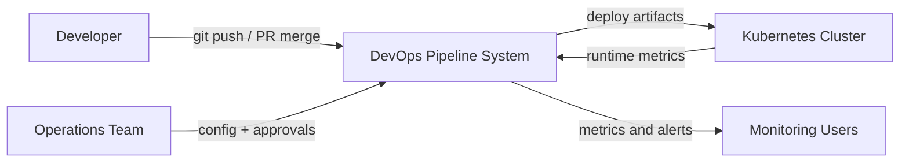
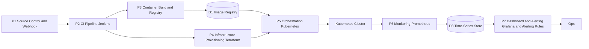
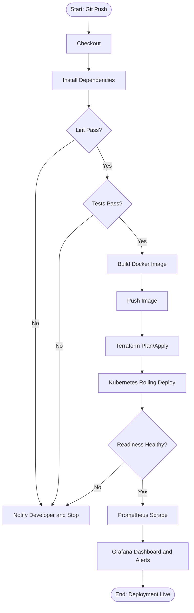

# DevOps Architecture and Design Notes

## Problem Statement
The baseline Django API is functionally complete but operationally weak without automated quality gates, repeatable deployments, scalable runtime orchestration, and observability.

## Objective Mapping
- Containerization: multi-stage Docker build in `docker/Dockerfile`
- CI/CD: declarative pipeline in `Jenkinsfile`
- Orchestration: Kubernetes manifests in `k8s/`
- IaC: Terraform stack in `terraform/`
- Monitoring: Prometheus + Grafana manifests in `k8s/monitoring/`

## DFD Level 0 (Context)

## DFD Level 1 (Expanded)

## CI/CD Flowchart

## Kubernetes Runtime Standards
- Deployment runs with 3 replicas.
- Rolling update strategy sets `maxUnavailable: 0` and `maxSurge: 1`.
- Liveness, readiness, and startup probes are enabled.
- HPA scales between 2 and 10 replicas based on CPU.
- ConfigMap and Secret are used for app configuration.

## Observability Standards
- Prometheus scrape interval: 15s.
- App metrics endpoint: `/metrics`.
- Baseline alerts include high P95 latency and high 5xx ratio.
- Grafana dashboard provisions API request rate and error trends.
